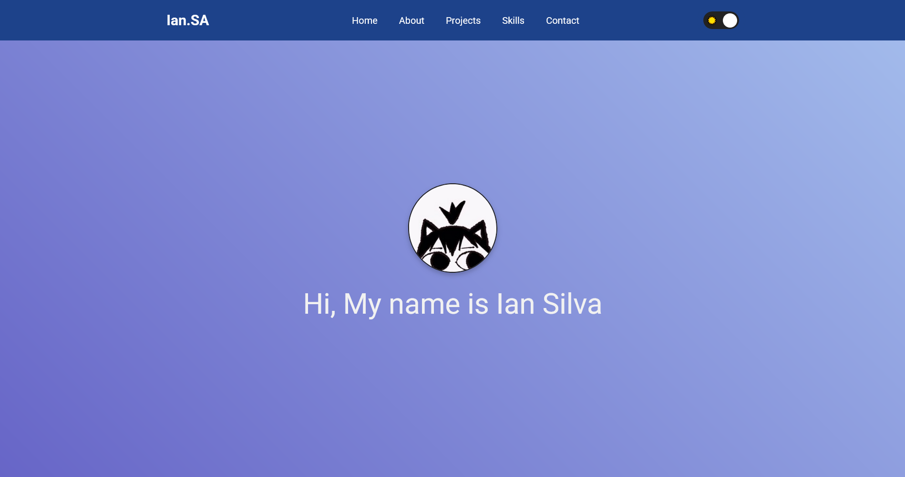

# Portfolio App

A simple portfolio application to showcase your projects and skills.

## Published in Github Pages

Link: https://nivekian.github.io/html-css-aval/

## Features

- Clean and responsive design
- Easy to customize
- Lightweight and fast

## Getting Started

### Prerequisites

- Modern web browser
- Basic knowledge of HTML/CSS

### Installation

1. Clone the repository
2. Open `index.html` in your browser

## Project Structure

```
portfolio-app/
├── index.html
├── css/
│   └── style.css
├── js/
│   └── script.js
└── assets/
    └── images/
```

## Portfolio Preview



## Customization

Edit the HTML and CSS files to add your own projects, skills, and contact information.

## License

MIT License

## Author

Ian Antunes

---